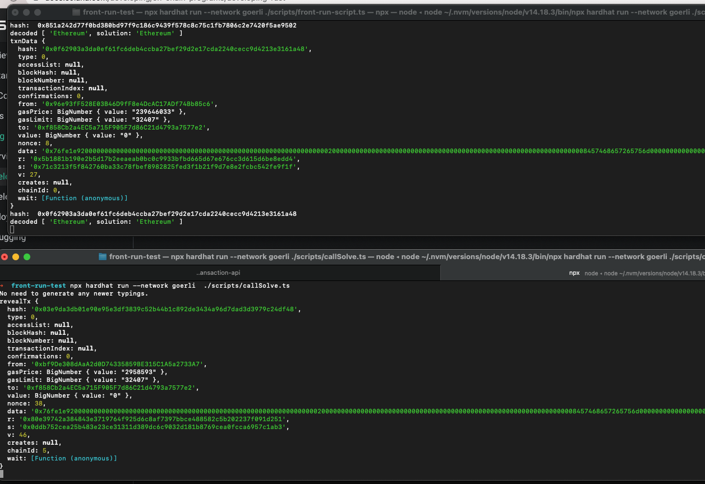

# Demo Front Running Attack

Transactions take some time before they are mined. An attacker can watch the transaction pool and send a transaction, have it included in a block before the original transaction. This mechanism can be abused to re-order transactions to the attacker's advantage.

A contract `FrontRun.sol` rewards who ever comes up with the keyword behind the hash.
Neverthless if a user comes up with the right keyword the front-run bots won't let him take the prize.
They will re-broadcast the transaction with higher gas then their transactions will take precedence.  


1st Terminal: Deploy contract to Goerli network. 
```shell
npx hardhat run --network goerli  ./scripts/deploy.ts
```

2nd Terminal: Start the front-running bot
```shell
npx hardhat run --network goerli  ./scripts/front-run-script.ts
```

3rd Terminal: User trying to claim reward with a right answer
```shell
npx hardhat run --network goerli  ./scripts/callSolve.ts
```



